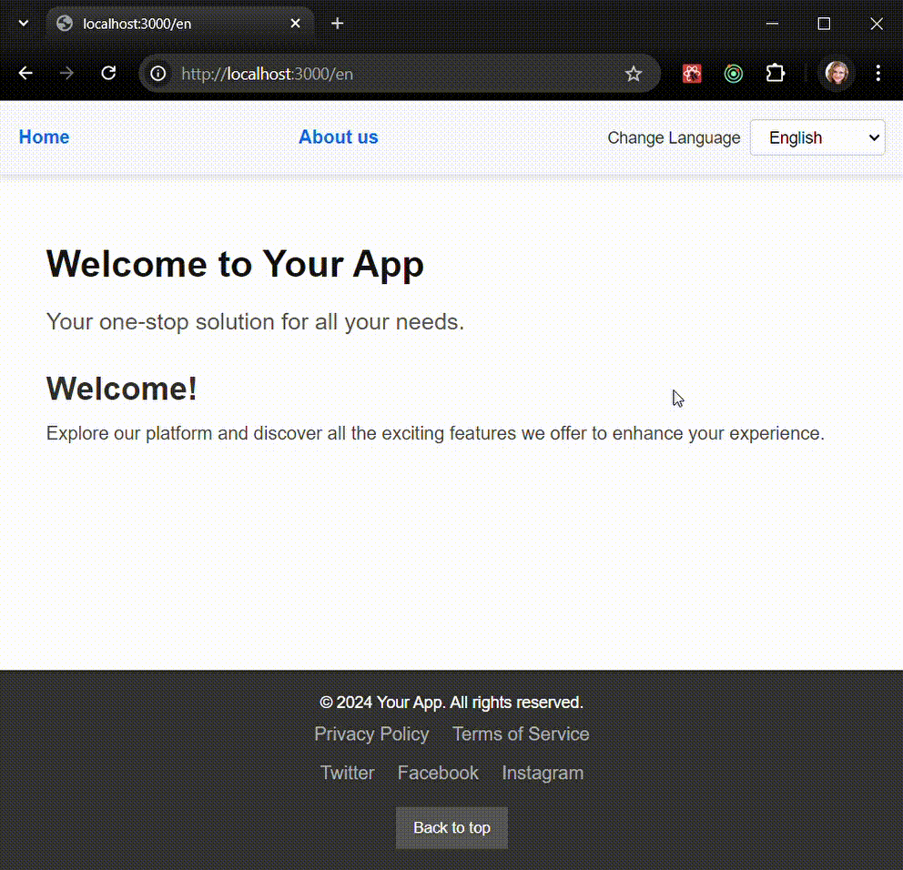

# Internationalization in a Next.js App

## Overview

In this project, you will implement a Next.js app with internationalization (i18n) support using the `next-intl` library. The app should allow users to switch between English and Ukrainian languages. You will also ensure that the components are fully functional by passing pre-written tests that verify language switching and correct rendering of translated content.

### Key Libraries:

- **Next.js**: A React-based framework for building web applications.
- **next-intl**: A library for adding internationalization support to Next.js apps.

### What You’ll Implement:

You are tasked with implementing several steps in the project that support both English and Ukrainian languages.  

The following steps need to be implemented:

1. **request.ts, routing.ts, middleware.ts, layout.tsx (in \_to-rename folder), next.config.mjs**

   - Code should be added according to described steps in [documentation](https://next-intl-docs.vercel.app/docs/getting-started/app-router/with-i18n-routing).

1. **Header Component**

   - The header should include navigation links (e.g., Home, About) and a language switcher dropdown to change between English and Ukrainian.
   - The `LangSwitcher` component should allow users to switch the language, and the corresponding text in the app should update dynamically.

1. **LangSwitcher Component**

   - A dropdown that lets users choose between English and Ukrainian.
   - Upon changing the language, the app should remain on the same page but with updated translations.

1. **HomePage Component**

   - The homepage should display a welcome message and a brief introduction text. The content should be fetched from the `next-intl` translation files.

1. **AboutPage Component**
   - The about page should contain sections like "Our Story," "Mission," and "Values." Each section should be localized, and the content should be dynamically translated when the language changes.

### What you have already

- Basic code of the components, you'll need to add internationalization functionality
- Files with translations (`_to-remame-translations/en.json`, `_to-remame-translations/uk.json`), you can use them
- Placement of files is correct, but you'll need to rename some folders (they are marked with `_to-remame_ prefix`)
